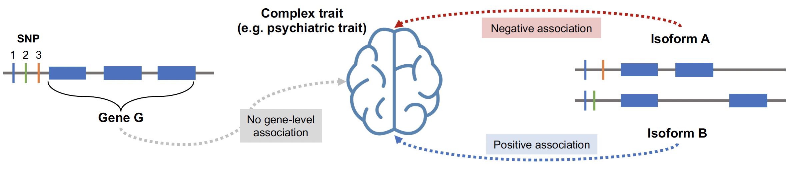

# isotwas

Welcome to isotwas, a package that facilitates isoform-level transcriptome wide associations studies. This package contains models to train multivariate predictive models of isoform-level expression and run isoform-level trait mapping to identify genetic associations with complex traits.

To install: `devtools::install_github("bhattacharya-a-bt/isoTWAS")`

Isoform-level analyses can provide further granularity to a gene-trait association by pinpointing the isoform of a given gene that drives the association. Furthermore, if two isoforms of the same genes have associations with divergent effect sizes, then gene-level trait mapping will likely miss this association but isoform-level trait mapping will not.

